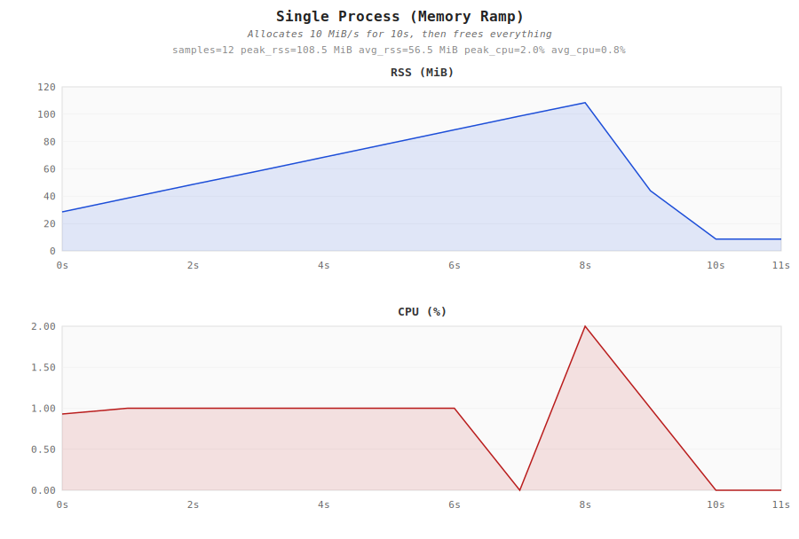
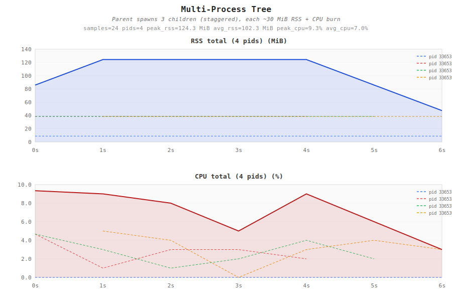
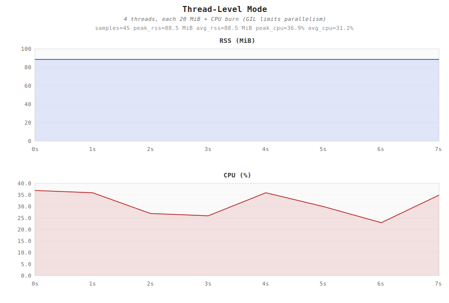
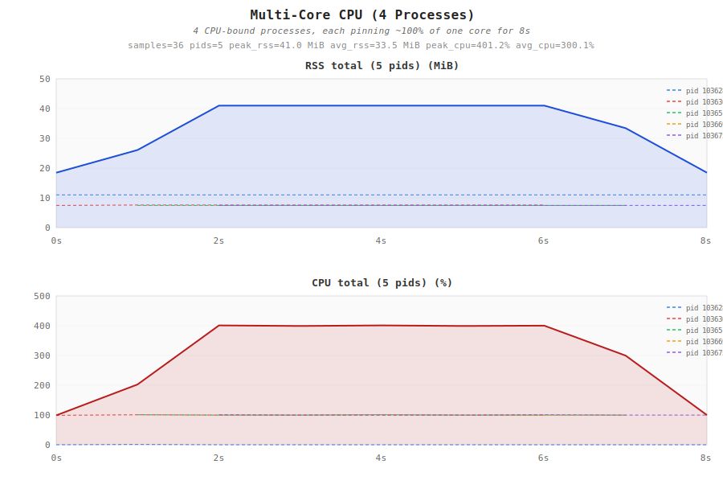
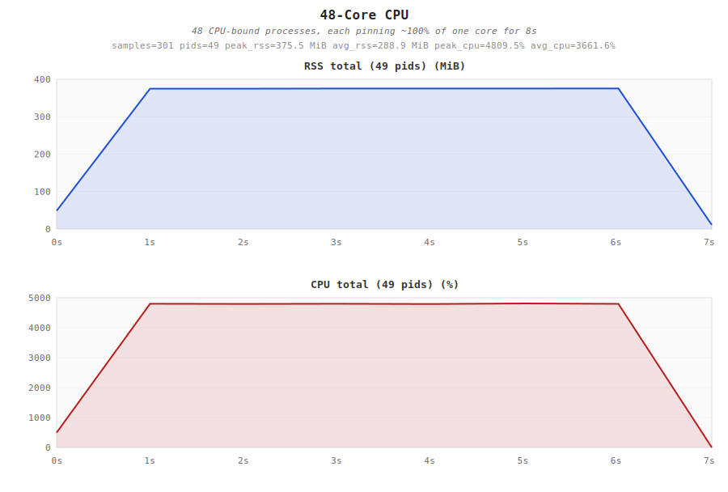
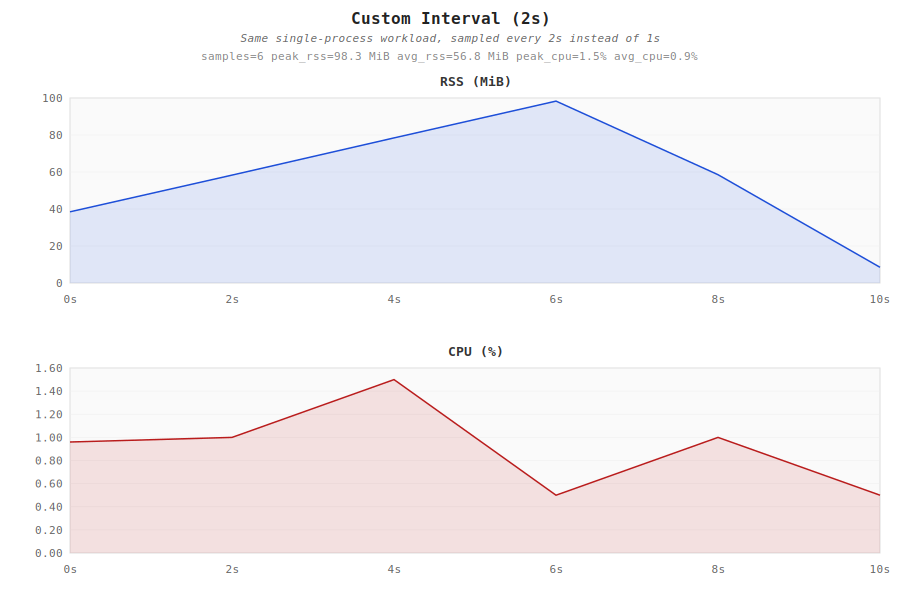
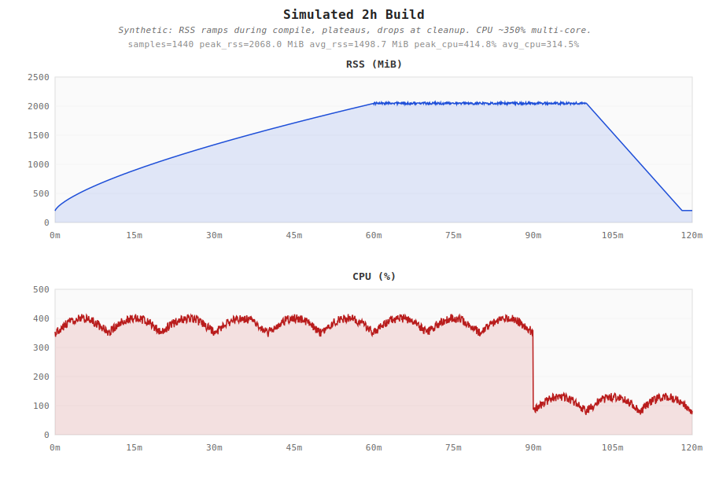

# perfsnap

A coding agent skill that collects RSS memory, CPU usage, and optional thread-level metrics for any local command by sampling `/proc` directly, then exports CSV and renders a two-panel SVG chart. Supports fractional (sub-second) sample intervals.

## What it does

When you ask your agent to profile a command (e.g. "how much memory does this use?", "track performance while it runs"), this skill:

1. Launches your command in the background
2. Samples the **entire process tree** (parent + all descendants) by reading `/proc/<pid>/stat`
3. Writes a clean CSV with PID/TID tracking
4. Renders a two-panel SVG chart (RSS MiB + CPU %) with per-PID breakdown

## Installation

### Claude Code

Tell Claude Code:

```
Fetch and follow instructions from https://raw.githubusercontent.com/huanglune/perfsnap/refs/heads/main/.claude/INSTALL.md
```

### Codex

Tell Codex:

```
Fetch and follow instructions from https://raw.githubusercontent.com/huanglune/perfsnap/refs/heads/main/.codex/INSTALL.md
```

### Prerequisites

- `python3` (no third-party packages required)
- Linux kernel with `/proc/<pid>/task/<tid>/children` support (default on any modern distro)

## Examples

All examples below are generated by the test suite (`python3 tests/run_tests.py`).

### Single Process — Memory Ramp

A Python process that allocates 10 MiB/s for 10 seconds, then frees everything.



- RSS ramps linearly from ~8 MiB to ~108 MiB, then drops sharply on `del`
- CPU stays low (~1-2%) since the workload is mostly `sleep` + allocation

### Multi-Process Tree

A parent process spawns 3 child processes (staggered by 1s), each holding ~30 MiB and burning CPU.



- **Per-PID dashed lines** show individual process contributions
- **Bold total line** aggregates RSS and CPU across all PIDs
- RSS total rises as children spawn and falls as they exit
- Legend in the top-right corner identifies each PID

### Thread-Level Mode

4 Python threads, each allocating 20 MiB and computing `sum(range(3M))`.



- RSS is constant (~88 MiB) because threads share address space
- CPU shows ~30% aggregate (GIL limits true parallelism)
- Thread IDs (tid) are preserved in the CSV for post-analysis

### Multi-Core CPU (4 Processes)

4 CPU-bound processes, each saturating one core for 8 seconds.



- Total CPU reaches ~400% (4 cores x 100%)
- Per-PID lines show each process at ~100%
- Staggered start/stop creates visible ramp-up and wind-down

### 48-Core CPU

48 CPU-bound processes, each saturating one core. Tests high PID count rendering (per-PID lines suppressed, only total shown).



- Total CPU reaches ~4800% (48 cores x 100%)
- Per-PID breakdown suppressed (>8 PIDs), title shows `(49 pids)` instead
- Y-axis snaps to round `0, 1000, 2000, 3000, 4000, 5000` ticks

### Custom Interval (2s)

Same single-process workload but sampled every 2 seconds instead of 1s.



- Fewer data points but correct 2-second spacing on X-axis
- RSS staircase is coarser but still captures the trend

### Simulated 2-Hour Build

Synthetic CSV simulating a long build: RSS ramps during compilation, plateaus, then drops during cleanup.



- X-axis automatically switches to **minute labels**: `0m, 15m, 30m, ... 120m`
- RSS shows the classic build pattern: ramp (0-60m) → plateau (60-100m) → cleanup (100-120m)
- CPU at ~350% during active compilation, dropping to ~80% at the end

## Usage

Once installed, just ask your agent to profile any command:

- "Profile the memory usage of `make build`"
- "How much RSS does `./my_benchmark` use?"
- "Track CPU and memory while running the index builder"
- "Profile this build with thread-level detail"

### Standalone (without an agent)

```bash
# Basic usage
./perfsnap/scripts/collect.sh /tmp/perf my_run -- ./my_command --flag

# Sub-second sample interval
PERFSNAP_INTERVAL=0.1 ./perfsnap/scripts/collect.sh /tmp/perf my_run -- ./my_command

# Thread-level collection
PERFSNAP_THREAD=1 ./perfsnap/scripts/collect.sh /tmp/perf my_run -- ./my_command

# Attach the sampler directly to an already-running PID
python3 perfsnap/scripts/sampler.py --root-pid 12345 --interval 0.5 --output out.csv
python3 perfsnap/scripts/plot.py out.csv out.svg --title "My Run"
```

### Environment Variables

| Variable | Default | Description |
|----------|---------|-------------|
| `PERFSNAP_INTERVAL` | `1` | Sample interval in seconds. Floats allowed; practical floor ~`0.05` (CPU% quantizes at the kernel clock tick, usually 10 ms). |
| `PERFSNAP_THREAD` | `0` | Set to `1` for thread-level collection |

### Output Files

| File | Contents |
|------|----------|
| `<prefix>.stdout.log` | Target command's stdout + stderr |
| `<prefix>.csv` | Per-sample rows (timestamps, CPU %, RSS, VSZ, faults, tid if thread mode) |
| `<prefix>.svg` | Two-panel chart: RSS (MiB) top, CPU (%) bottom |

## Testing

Run the full test suite:

```bash
python3 tests/run_tests.py
```

Run a single test:

```bash
python3 tests/run_tests.py single_proc
python3 tests/run_tests.py sim_long_duration
```

Available tests: `single_proc`, `multi_proc`, `thread_mode`, `cpu_multicore`, `cpu_48core`, `interval_2s`, `sim_long_duration`

Test workloads live in `tests/workloads/` — each is a standalone Python script that simulates a specific resource pattern. The test runner invokes them through `collect.sh` (the real skill pipeline), so any change to the scripts is automatically covered.

## License

MIT
